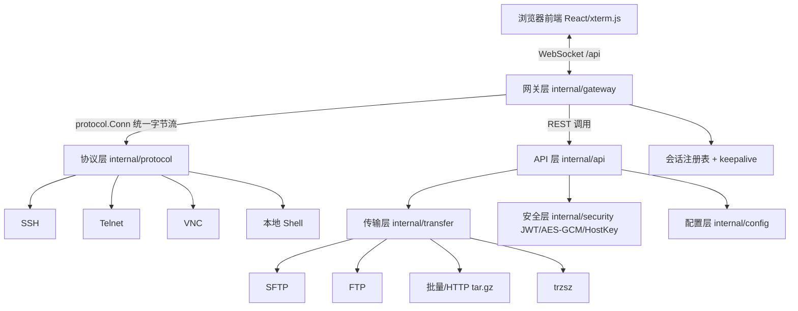

# go-Term

> 基于 Go 重写的全功能 Web 终端 / 远程连接引擎。单二进制后端 + React 前端，提供 SSH / Telnet / VNC / 本地 Shell 的浏览器终端，以及 SFTP / FTP 文件管理、批量传输与 trzsz 文件传输协议能力。

---

## 1. 项目介绍

`go-Term` 是一个用 Go 实现的 Web 终端网关。它将多种远程访问协议（SSH、Telnet、VNC、本地伪终端）统一抽象为 `protocol.Conn` 字节流，再通过 WebSocket 与浏览器端的 xterm.js 前端桥接，实现"在浏览器里操作任意远程主机"的目标。

设计目标：

- **单二进制部署**：后端 `go build` 出一个可执行文件即可运行，无需外部依赖。
- **多协议统一**：所有协议实现同一个 `protocol.Conn` 接口，网关对其一视同仁。
- **前后端分离**：后端只负责协议接入、文件传输与 REST/WS 网关；前端用 React + xterm.js 渲染终端 UI。
- **可扩展传输层**：`transfer.Transferer` 接口统一了 SFTP / FTP / 批量 / trzsz 等文件传输实现。

---

## 2. 特性清单

### 终端协议

| 协议 | 实现位置 | 能力 |
| --- | --- | --- |
| **SSH** | `internal/protocol/ssh` | 密码 / 公钥 / 键盘交互(含 2FA) / SSH-Agent 认证；跳板机链路（`Proxy` 单跳 + `Hops` 多跳）；本地 / 远程 / 动态（SOCKS5）端口转发；PTY 会话与窗口尺寸变更；可执行单条命令替代交互式 Shell |
| **Telnet** | `internal/protocol/telnet` | 自实现 RFC 854 客户端，含 IAC 协商剥离与 NAWS 窗口尺寸上报 |
| **VNC** | `internal/protocol/vnc` | RFB 3.3/3.7/3.8 握手，`None` 与 `VNC Auth`（DES challenge-response）两种安全类型 |
| **本地 Shell** | `internal/protocol/localshell` | 通过 `creack/pty` 在服务器本机启动伪终端（bash/zsh/cmd），可用 `DISABLE_LOCAL_TERMINAL` 禁用 |

> **`~/.ssh/config` 别名自动套用**：`internal/protocol/ssh/sshconfig.go` 的 `ParseSSHConfig` / `ResolveSSHConfig`（支持 `Host`/`HostName`/`User`/`Port`/`IdentityFile`/`ProxyJump`/`StrictHostKeyChecking` 与通配符匹配）已在建连时自动应用。新建 SSH 连接时，连接表单的「SSH 配置别名」下拉会列出服务器 `~/.ssh/config` 中的 Host 别名；选中后主机/端口/用户名留空即由别名自动套用，手动填写的字段优先于别名值。`IdentityFile` 对应的私钥由**服务器侧**直接读取（不从浏览器上传）。详见 §8「SSH 配置别名」。

### 文件传输

| 能力 | 实现位置 | 说明 |
| --- | --- | --- |
| **SFTP 文件管理器** | `internal/transfer/sftp` | 列目录 / 上传 / 下载 / 新建目录 / 重命名 / 删除 / `chmod` / `stat` / 符号链接 / 递归列出目录大小 |
| **FTP 文件管理器** | `internal/transfer/ftp` | 列目录 / 上传 / 下载 / 新建目录 / 重命名 / 删除 / `stat`（`chmod`、`symlink` 在 `jlaffaye/ftp v0.2.1` 无 API，返回明确的 `unsupported` 错误） |
| **HTTP 批量上传/下载** | `internal/transfer/http` | 将远程目录递归下载为 `tar.gz`、或将本地 `tar.gz` 解包后批量上传；底层使用 `batch` 包（16 并发） |
| **批量传输** | `internal/transfer/batch` | 64 并发信号量 + 断点续传（按文件大小比对跳过已传输/已下载项）+ 递归展开目录 + `tar.gz` 打包/解包（含路径穿越防护） |
| **trzsz** | `internal/transfer/trzsz` | 通过 `creack/pty` 桥接服务器侧 `trz`/`tsz` 二进制实现，兼容 trzsz 终端内文件传输协议；`trz` 为接收、`tsz` 为发送 |

> **trzsz 已接入运行时**：trzsz 已实现并通过单元测试，现通过 WebSocket `transfer` 消息与 `/api/transfer-upload`、`/api/transfer-file`、`/api/transfer-bins` 端点完全接通。工具栏的「传输」按钮组（收/发）即可触发：发送时浏览器所选文件先经 HTTP 上传到服务器 `upload_dir` 临时目录，再驱动传输；接收完成后文件落 `download_dir`，前端自动取回归本地下载。传输期间网关以 `gateMu` 独占会话 `Conn`，暂停常规终端桥接。详见 §8「终端内文件传输」。
>
> ⚠️ **ZMODEM和XMODEM已移除**：本项目不再支持老旧协议 ZMODEM和XMODEM 终端内文件传输，相关后端与前端 UI 已全部删除；文件传输仅保留较新的 **trzsz**。

### 网关 / 前端

- **网关**（`internal/gateway`）：WebSocket 升级（接受任意 Origin）+ 路由；会话注册表（`sync.Map`）+ 周期性 keepalive 广播；远端字节流与 WebSocket 消息的双向桥接（输入/输出均 Base64 编码）。
- **前端**（React + TypeScript + Vite + Tailwind + zustand）：
  - **xterm.js 终端**：内置 `@xterm/addon-fit`、`@xterm/addon-search`、`@xterm/addon-web-links`；`WebGL / Image / Ligatures` 三个插件为**可选动态加载**（仅当对应 npm 包被安装时才启用，默认不依赖）。
  - **多标签 / 分屏**：`TabManager` 标签栏支持切换/关闭/新建/分屏，`SplitPane` 提供可拖拽分隔的并排或上下分屏。
  - **侧边栏文件管理器 + 在线编辑**：`FilePanel` 支持列目录、上传、下载、新建目录、重命名、删除；`EditorModal` 支持把远程文本文件拉取下来在浏览器内编辑后回写。
  - **快捷命令 / 命令历史**：`QuickInput`（底部快捷输入）与「快捷命令」侧栏均支持「当前 / 广播」目标切换——选「广播」即把命令同时下发到**所有已连接主机**（按会话 `status === 'open'` 计数，无已连接主机时自动禁用）。`quickCommands.ts` / `history.ts` 维护快捷命令与历史；**快捷命令现已支持自定义编辑**：在「快捷命令」面板可新增 / 编辑 / 删除命令（两步确认防误删），改动持久化到 `goterm-quick`（localStorage）。
  - **主题 / 编码 / 日志**：`settingStore` 持久化主题（暗/亮）、字号、字体、编码、光标闪烁、滚动缓冲；`logStore` + `LogViewer` 记录操作日志。
  - **连接管理侧栏**：连接按分组树状展示；支持新建/编辑连接、分组改名/排序/删除、连接行勾选后批量移动分组或批量删除。

### 安全

- **用户名/密码 Web 登录**：账号存于 SQLite `users` 表，密码以 bcrypt 哈希存储；登录成功签发 JWT（HS256）。`ENABLE_AUTH=1` 时，除 `/api/login`、`/api/public/config` 外的所有 REST 与 `/ws` 均需携带 JWT。`/api/public/config` 免鉴权，前端据此决定是否显示登录页。用户管理（`GET/POST /api/users`、`DELETE /api/users/:id`、`POST /api/users/:id/reset-password`，以及登录锁定的 `GET /api/users/lockouts`、`POST /api/users/lockouts/:ip/unlock`）仅 admin 可用。**管理员不能删除自己当前登录的账户**（`DELETE /api/users/:id` 会校验调用者身份并返回错误，前端按钮亦禁用），避免唯一管理员被删导致系统锁死。首次启动通过环境变量 `GOTERM_BOOTSTRAP_ADMIN_USER` / `GOTERM_BOOTSTRAP_ADMIN_PASS` 引导创建管理员（fail-closed：未同时配置则不自动建管理员）。
- **登录暴力破解防护（IP 级、持久化）**：登录失败计数器按**客户端 IP**（而非用户名）累计并落库 SQLite `login_lockouts` 表，进程重启后仍生效；攻击者无法通过轮换用户名重置计数。升级策略：连续 **3 次**失败锁定 **60 秒**，**5 次**锁定 **1 小时**，**10 次**永久禁止（banned）。仅当**该 IP 成功登录**或**管理员在「用户管理 → 登录锁定」中解锁**后才会清除。锁定状态通过 `X-Forwarded-For` / `X-Real-IP`（反向代理场景）回退 `RemoteAddr` 取客户端 IP。前端登录页在锁定期间显示实时倒计时并禁用登录按钮。
- **AES-256-GCM 凭证加密**：`internal/security/crypto.go` 用密钥（取自 `GOTERM_VAULT_KEY`，缺失时回退 `APP_SECRET`）对密码/私钥/口令做 AES-256-GCM 加密后存入 SQLite `credentials` 表；明文永不落库，按需经 `GET /api/credentials/:id/secret` 解密单条明文。
- **known_hosts HostKey 验证**：`internal/security/hostkey.go` 基于 `golang.org/x/crypto/ssh/knownhosts` 实现 TOFU（首次信任并持久化）。
- **SERVER_USER 白名单（与 Web 登录正交）**：仅约束**本地终端（localshell）**特权操作（`RequireServerUser` 中间件，挂载于 `POST /api/hostkey`）；Web 登录只认 `users` 表，不受 `SERVER_USER` 限制。
- **本地终端禁用**：`DISABLE_LOCAL_TERMINAL=1` 可在网关层拒绝本地 Shell 连接。

---

## 3. 架构概览



分层一句话：**协议层**把各类远程协议收敛为统一的 `Conn` 字节流；**传输层**在其上提供统一的 `Transferer` 文件操作；**网关层**负责 WebSocket 接入与会话生命周期；**安全层**提供鉴权与加密；**前端**通过 WS/REST 与之交互。

---

## 4. 目录结构

```text
go-Term/
├── cmd/
│   └── server/
│       └── main.go                 # 入口：加载配置、初始化 Logger、启动 Server
├── internal/
│   ├── server.go                   # 装配协议/网关/REST，启动 HTTP 服务
│   ├── config/
│   │   ├── config.go               # 配置加载（viper；CLI > env > yaml > 默认）
│   │   ├── flags.go                # 命令行参数解析（标准库 flag，优先级最高）
│   │   └── config.yaml             # 示例配置文件
│   ├── security/
│   │   ├── jwt.go                  # JWT 签发/校验（HS256）
│   │   ├── crypto.go               # AES-256-GCM 凭据加密
│   │   └── hostkey.go              # known_hosts 校验/写入/指纹
│   ├── api/
│   │   ├── router.go               # gin 路由注册
│   │   ├── middleware.go           # JWTAuth / RequireServerUser
│   │   ├── handlers.go             # 登录、文件管理、凭据保险库、hostkey 等处理器
│   │   ├── auth_handlers.go        # 登录 / 用户管理 / 重置密码（含禁止自删守护）
│   │   ├── login_guard.go          # 登录暴力破解防护（IP 级、持久化锁定）
│   │   └── lockout_handlers.go     # 管理员列出 / 解锁登录锁定（仅 admin）
│   ├── gateway/
│   │   ├── ws.go                   # WebSocket 升级与连接路由
│   │   ├── session.go              # Session / SessionRegistry / keepalive
│   │   └── stream.go               # WritePump / ReadPump 双向桥接
│   ├── protocol/
│   │   ├── protocol.go             # Conn / Protocol 接口与注册表、错误哨兵
│   │   ├── connection.go           # Connection 规格定义（含 Proxy/Hops/Tunnel）
│   │   ├── ssh/                    # SSH 实现：ssh.go auth.go hopping.go sshconfig.go tunnel.go
│   │   ├── telnet/                 # Telnet 实现
│   │   ├── vnc/                    # VNC/RFB 实现
│   │   └── localshell/             # 本地伪终端实现
│   └── transfer/
│       ├── transfer.go             # Transferer 接口与共享数据结构
│       ├── sftp/  ftp/             # SFTP / FTP 实现
│       ├── http/                    # 目录级 tar.gz 上传/下载
│       ├── batch/                   # 并发/断点/递归/打包
│       ├── trzsz/                     # trzsz 实现
├── frontend/
│   ├── index.html  vite.config.ts  tsconfig.json
│   ├── package.json  postcss.config.js  tailwind.config.js
│   ├── src/
│   │   ├── App.tsx  main.tsx  types.ts
│   │   ├── api/        # ws.ts（WebSocket 客户端）、rest.ts（REST 封装）
│   │   ├── terminal/   # XTermView / TabManager / SplitPane / theme / encoding
│   │   ├── ssh/        # connectForm / history / quickCommands / sendCommand(当前·广播发送)
│   │   ├── filemanager/# FilePanel / EditorModal / fileApi
│   │   ├── components/ # Sidebar / Toolbar / StatusBar / QuickInput / LogViewer / QuickCommandPanel
│   │   └── store/      # sessionStore / settingStore / logStore / transferStore / authStore
│   └── dist/           # 生产构建产物（由 `npm run build` 生成；见下方"已知限制"）
└── go.mod / go.sum
```

---

## 5. 安装与依赖

**后端**

- Go **1.26+**（见 `go.mod` 的 `go 1.26`）。
- 依赖已收敛在 `go.mod`，常见库：`gin`（HTTP）、`gorilla/websocket`（WS）、`golang.org/x/crypto`（SSH）、`pkg/sftp`、`jlaffaye/ftp`、`golang-jwt/jwt/v5`、`spf13/viper`、`creack/pty`、`uber/zap`。

**前端**

- Node.js **22+**（Vite 8 要求）。
- 主要依赖：`react`、`@xterm/xterm` 及 `addon-fit`/`addon-search`/`addon-web-links`、`zustand`、`tailwindcss`、`vite@5`、`typescript`。

---

## 6. 配置（环境变量表）

配置加载优先级：**命令行参数 > 环境变量 > `config.yaml` > 内置默认值**（`internal/config`）。`config.yaml` 默认搜索路径为 `./internal/config/` 与当前目录。命令行参数的用法与完整参数表见下方 [命令行参数（CLI 启动方式）](#命令行参数cli-启动方式)。

| 环境变量 | 对应配置项 | 默认值 | 说明 |
| --- | --- | --- | --- |
| `GOTERM_LISTEN` | `listen` | `:8080` | HTTP/WebSocket 监听地址 |
| `GOTERM_MAX_CONCURRENCY` | `max_concurrency` | `64` | 最大并发会话数 / 传输 worker 数（≤0 时回退 64） |
| `ENABLE_AUTH` | `auth_enabled` | `false` | 是否启用 Web 用户名/密码登录与 JWT 鉴权（`1`/`true`/`yes` 等为真）。开启后除 `/api/login`、`/api/public/config` 外，所有 REST 与 `/ws` 均须携带 JWT |
| `DISABLE_LOCAL_TERMINAL` | `disable_local_terminal` | `false` | 禁用内置本地终端 |
| `SERVER_USER` | `server_user` | `""` | 仅约束本地终端等特权操作的逗号分隔白名单（与 Web 登录正交：Web 登录只校验 `users` 表，不受此限制；为空=不限制） |
| `APP_SECRET` | `app_secret` | `change-me-insecure-app-secret` | 当 `GOTERM_VAULT_KEY` 未设置时作为 AES-256-GCM 凭证加密密钥；`JWT_SECRET` 未设置时也回退到此值（**生产务必修改**） |
| `JWT_SECRET` | `jwt_secret` | `""` | JWT 签名密钥；为空时回退到 `APP_SECRET` |
| `JWT_EXPIRE_MINUTES` | `jwt_expire_minutes` | `1440` | JWT 有效期（分钟，即 24h） |
| `GOTERM_DB_PATH` | `db_path` | `./go-Term.db` | SQLite 数据库文件路径（纯 Go `modernc.org/sqlite`，`CGO_ENABLED=0` 兼容）；`users`/`connection_groups`/`connections`/`credentials`/`user_settings`/`login_lockouts` 六张表均落于此 |
| `GOTERM_VAULT_KEY` | `vault_key` | `""` | 凭证库 AES-256-GCM 加密密钥；为空时回退到 `APP_SECRET`（与 JWT 密钥解耦） |
| `GOTERM_BOOTSTRAP_ADMIN_USER` | `bootstrap_admin_user` | `""` | 首启引导管理员用户名；须与 `GOTERM_BOOTSTRAP_ADMIN_PASS` **同时**设置方生效（fail-closed：缺失则不自动建管理员） |
| `GOTERM_BOOTSTRAP_ADMIN_PASS` | `bootstrap_admin_pass` | `""` | 首启引导管理员密码（bcrypt 哈希后入库） |
| `GOTERM_KNOWN_HOSTS` | `known_hosts` | `~/.ssh/known_hosts` | known_hosts 文件路径（`~` 会展开为用户主目录） |
| `GOTERM_LOG_LEVEL` | `log_level` | `info` | 日志级别：`debug`/`info`/`warn`/`error` |

仅 `config.yaml` 提供、未绑定环境变量（可使用 `upload_dir` / `download_dir` 键配置）：

| 配置项 | 默认值 | 说明 |
| --- | --- | --- |
| `upload_dir` | `./data/uploads` | HTTP 上传临时目录（启动时自动创建） |
| `download_dir` | `./data/downloads` | HTTP 下载临时目录（终端内文件传输 recv 落盘处）；凭证库已改为 SQLite 存储，不再有此目录下的 `credentials.json` |

由传输包在运行时直接通过 `os.Getenv` 读取（非 `config.yaml`）：

| 环境变量 | 说明 | 默认值 |
| --- | --- | --- |
| `GOTERM_TRZ_BIN` | trzsz 接收工具 `trz` 的路径 | `trz` |
| `GOTERM_TSZ_BIN` | trzsz 发送工具 `tsz` 的路径 | `tsz` |

### 命令行参数（CLI 启动方式）

除环境变量与 `config.yaml` 外，也可以在启动时直接传命令行参数。命令行参数优先级最高（**命令行参数 > 环境变量 > `config.yaml` > 内置默认值**），且只有**实际显式传入**的参数才会覆盖其余来源（默认值不生效，因此不会误伤 env/yaml 已设的值）。等价于运行编译后的二进制：`./go-Term [flags]`（或 `go run ./cmd/server [flags]`）。

| 参数 | 短名 | 类型 | 默认 | 映射配置项 / 环境变量 |
| --- | --- | --- | --- | --- |
| `--host` | — | string | `""` | 与 `--port` 合并为 `listen`（监听主机；空 = 监听所有网卡） |
| `--port` | — | string | `""` | 与 `--host` 合并为 `listen`（端口；`--host` 未指定时回退常量 `8080`） |
| `--listen` | — | string | `""` | `listen` / `GOTERM_LISTEN`（完整地址，优先级高于 `--host`/`--port`） |
| `--config` | `-c` | string | `""` | 指定唯一 YAML 配置文件（viper `SetConfigFile`，不回退默认搜索路径） |
| `--log-level` | — | string | `info` | `log_level` / `GOTERM_LOG_LEVEL`：`debug`/`info`/`warn`/`error` |
| `--auth` | — | bool | `false` | `auth_enabled` / `ENABLE_AUTH`（启用 Web 登录与 JWT 鉴权） |
| `--server-user` | — | string(csv) | `""` | `server_user` / `SERVER_USER`（本地终端/特权操作白名单，逗号分隔） |
| `--db-path` | — | string | `./go-Term.db` | `db_path` / `GOTERM_DB_PATH` |
| `--vault-key` | — | string | `""` | `vault_key` / `GOTERM_VAULT_KEY`（⚠ 机密，建议用环境变量） |
| `--known-hosts` | — | string | `~/.ssh/known_hosts` | `known_hosts` / `GOTERM_KNOWN_HOSTS` |
| `--upload-dir` | — | string | `./data/uploads` | `upload_dir`（仅 `config.yaml`/CLI，无对应环境变量） |
| `--download-dir` | — | string | `./data/downloads` | `download_dir`（仅 `config.yaml`/CLI，无对应环境变量） |
| `--max-concurrency` | — | int | `64` | `max_concurrency` / `GOTERM_MAX_CONCURRENCY` |
| `--bootstrap-admin-user` | — | string | `""` | `bootstrap_admin_user` / `GOTERM_BOOTSTRAP_ADMIN_USER` |
| `--bootstrap-admin-pass` | — | string | `""` | `bootstrap_admin_pass` / `GOTERM_BOOTSTRAP_ADMIN_PASS`（⚠ 机密） |
| `--help` | `-h` | bool | — | 打印用法并退出（exit 0） |
| `--version` | `-v` | bool | — | 打印版本 `go-Term 1.0.0` 并退出（exit 0） |

> **机密提示**：`--vault-key` / `--bootstrap-admin-pass` 会出现在进程参数列表（`ps`）中，生产建议改用环境变量 `GOTERM_VAULT_KEY` / `GOTERM_BOOTSTRAP_ADMIN_PASS` 设置。`APP_SECRET` / `JWT_SECRET` **不提供**命令行参数（出现在 `ps` 违背 fail-closed），请仅通过环境变量或 `config.yaml` 设置。

未识别参数走标准库 `flag` 默认行为（打印 usage 并 `exit 2`）。

---

## 7. 快速开始

### 后端启动

```bash
cd go-Term
go run ./cmd/server
# 默认监听 :8080
```

如需自定义：

```bash
GOTERM_LISTEN=:9000 ENABLE_AUTH=1 APP_SECRET=$(openssl rand -hex 32) \
JWT_SECRET=$(openssl rand -hex 32) SERVER_USER=alice,bob \
go run ./cmd/server
```

命令行参数方式（与上面的环境变量方式等价，且优先级更高）：

```bash
# 监听所有网卡的 5517 端口
go run ./cmd/server --host 0.0.0.0 --port 5517

# 或一次性指定完整监听地址（优先级高于 --host/--port）
go run ./cmd/server --listen 0.0.0.0:5517

# 启用 Web 登录鉴权，并以 CLI 指定引导管理员
# （密码类机密建议仍走环境变量，避免出现在 ps 中）
GOTERM_BOOTSTRAP_ADMIN_PASS=$(openssl rand -hex 16) \
go run ./cmd/server --auth --bootstrap-admin-user admin --host 0.0.0.0 --port 5517

# 指定唯一配置文件（不回退默认搜索路径）
go run ./cmd/server -c /etc/webssh/config.yaml

# 查看帮助与版本
go run ./cmd/server --help
go run ./cmd/server --version
```

### 前端开发

```bash
cd go-Term/frontend
npm install
npm run dev
# 默认 http://localhost:5173，dev 代理把 /api 与 /ws 转发到 http://localhost:8080
```

Vite 代理配置（`frontend/vite.config.ts`）：

```ts
server: {
  port: 5173,
  proxy: {
    '/api': { target: 'http://localhost:8080', changeOrigin: true },
    '/ws':  { target: 'ws://localhost:8080', ws: true, changeOrigin: true },
  },
}
```

### 生产构建

```bash
cd go-Term/frontend
npm install
npm run build          # 产物输出到 frontend/dist
```

> ⚠️ **关于"后端托管前端静态资源"**：默认 `go build`（不带 build tag）下，`static.Register` 为空操作，后端**不**嵌也不托管 `frontend/dist`，只有 `/api/*` 与 `/ws` 两条路由。若要以单二进制部署，可在构建时加 `embedstatic` build tag（`go build -tags embedstatic`），并把 `frontend/dist` 复制到 `internal/static/dist` 后再编译，此时后端会把 SPA 以 `//go:embed` 嵌入并作为 `NoRoute` 兜底提供（开发态仍用 Vite dev server）。否则生产部署请按 [已知限制](#11-已知限制) 中的方式，用独立的静态服务器或反向代理来提供 SPA 并转发 API/WS。

常见生产构建（无 CGO、双架构，按服务器 `uname -m` 选择 amd64/arm64）：

```bash
# 1) 构建前端并同步到 internal/static/dist
cd frontend && npm install && npm run build && cp -r dist/. ../internal/static/dist/

# 2) 交叉编译 Linux 二进制
CGO_ENABLED=0 GOOS=linux GOARCH=amd64 go build -tags embedstatic -o dist/go-Term-amd64 ./cmd/server
CGO_ENABLED=0 GOOS=linux GOARCH=arm64 go build -tags embedstatic -o dist/go-Term-arm64 ./cmd/server
```

---

## 8. 使用说明

### 建立连接

- 点击界面右上角「＋ 新建」打开连接表单：选择协议（SSH / Telnet / VNC / 本地终端）、填写主机/端口/凭据、可选启动命令与严格 HostKey 校验，SSH 还可选择 SFTP 或 FTP 文件传输协议。
- 支持「测试连接」：调用 `POST /api/test-terminal`，仅验证连通性、不保留会话。
- 连接规格也可通过 **URL query 初始化**：浏览器端拼接查询参数后交由连接表单预填（协议/主机/端口/用户名等），便于从外部系统一键拉起会话。
- 所有会话通过 `WSClient` 与后端 `/ws` 建立长连接，连接负载为：

```json
{ "type": "connect", "session": "<id>", "payload": { "connection": { ... } } }
```

### SSH 配置别名

- 当后端服务器存在 `~/.ssh/config` 时，SSH 连接表单的「SSH 配置别名」下拉会列出其中的 Host 别名（来自 `GET /api/ssh-config-hosts`）。
- 选中某个别名后，**主机 / 端口 / 用户名留空即可由该别名自动套用**（`HostName` / `Port` / `User` / `IdentityFile` / `ProxyJump` / `StrictHostKeyChecking`），前置条件为空时取别名值。
- **手动填写优先**：若你显式填写了主机/端口/用户名等字段，该值会覆盖别名对应项（`Proxy` 单跳 / `Hops` 多跳同理，仅当用户未显式填写时由 `ProxyJump` 推导）。
- `IdentityFile` 对应的私钥由**后端服务器侧**直接 `os.ReadFile` 读取并填入凭据，浏览器不传输私钥内容；若该别名设置了 `StrictHostKeyChecking`，未显式设置时按别名值生效（`no`/`off`/`false` 表示不强制）。

### WebSocket 协议（envelope）

- **客户端 → 服务端**
  - `connect`：`payload.connection` 为连接规格。
  - `input` / `data`：`payload.data` 为 **Base64** 编码的用户输入字节。
  - `resize`：`payload.{cols,rows}` 调整远端 PTY/窗口。
  - `keepalive`：心跳。
  - `hostkey_accept`：当前为 **no-op**（见安全说明）。
  - `transfer`：触发终端内文件传输，`payload` 为 `{ "protocol": "trzsz", "direction": "send|recv", "file": "<服务器临时路径或落盘目录>" }`；`send` 的 `file` 为 `POST /api/transfer-upload` 返回的路径，`recv` 的 `file` 可空。
  - `close`：关闭会话。
- **服务端 → 客户端**
  - `data`：`payload.data` 为 **Base64** 编码的远端输出。
  - `keepalive`：服务端周期性下发（默认 30s 一次）。
  - `error`：`payload` 为错误文本。
  - `close`：远端关闭。
  - `transfer_status`：文件传输进度回报，`payload` 为 `{ "protocol", "direction", "status": "running|done|error", "error": "...", "path": "<落盘路径>" }`；传输期间网关独占会话 `Conn`，常规桥接暂停。

### 文件管理操作

- 在右侧「文件」面板浏览远程目录：列目录、上传、下载、新建目录、重命名、删除。
- 点击文本文件「编辑」可打开 `EditorModal` 在线编辑并回写。
- 后端 REST 端点（均受 JWT 保护，除 `/api/login`）：
  - `POST /api/list`、`POST /api/mkdir`、`POST /api/rename`、`POST /api/remove`
  - `GET /api/file`（下载单文件）、`POST /api/file`（上传单文件，multipart）
  - `GET /api/download`、`POST /api/upload`（目录级 `tar.gz` 批量通道）
  - `GET /api/hostkey`、**`POST /api/hostkey`（挂载 `RequireServerUser`）**（查看/写入 trusted host key）
  - `GET/POST /api/credentials`、**`PUT/DELETE /api/credentials/:id`**、`GET /api/credentials/:id/secret`（SQLite 凭证库，AES-256-GCM 加密，按用户隔离；`secret` 端点按需解密单条明文）
  - `GET /api/ssh-config-hosts`（服务器 `~/.ssh/config` 的 Host 别名列表）
  - `POST /api/transfer-upload`（multipart 文件落地 `upload_dir`，返回服务器临时路径）、`GET /api/transfer-file?path=`（取回归本地下载的落盘文件）、`GET /api/transfer-bins`（外部 `trz`/`tsz` 可用性）
  - `GET /api/local-shell-enabled`、`GET /api/sessions`、`POST /api/login`

### 用户、连接与凭证管理（REST）

本增量引入了多用户体系与持久化存储（SQLite，纯 Go `modernc.org/sqlite`，`CGO_ENABLED=0` 兼容），相关端点：

- **登录与身份**：`GET /api/public/config` 免鉴权返回 `{auth_enabled, version}`，前端据此决定是否显示登录页；`POST /api/login` 校验 `users` 表 + bcrypt 后签发 JWT（HS256），返回 `{token,user,role}`；`GET /api/me` 返回当前用户。`ENABLE_AUTH=0` 时后端对所有 API/WS 直通，前端不显示登录页。
- **用户管理（仅 admin）**：`GET/POST /api/users`、`DELETE /api/users/:id`、`POST /api/users/:id/reset-password`，以及登录锁定的 `GET /api/users/lockouts`、`POST /api/users/lockouts/:ip/unlock`。**管理员不能删除自己当前登录的账户**（`DELETE` 会校验调用者并返回错误）。首次启动通过 `GOTERM_BOOTSTRAP_ADMIN_USER` / `GOTERM_BOOTSTRAP_ADMIN_PASS` 引导创建首个管理员；两者未同时配置则 fail-closed，不自动建管理员。
- **凭证保险库（按用户隔离）**：`GET/POST /api/credentials`、`PUT/DELETE /api/credentials/:id`、`GET /api/credentials/:id/secret`。密码/私钥/口令在服务端以 AES-256-GCM 加密（密钥取 `GOTERM_VAULT_KEY`，缺省回退 `APP_SECRET`）后存入 `credentials` 表，明文不落库；列表不返明文，`secret` 端点按需解密单条。建立 WebSocket 连接时可用 `credential_id` 引用保险库凭证，后端在拨号时服务端解密，前端无需内联明文。
- **保存的连接与分组（按用户隔离）**：`GET/POST /api/connections`、`PUT/DELETE /api/connections/:id`、`GET/POST /api/connection-groups`、`PUT/DELETE /api/connection-groups/:id`。前端「连接」侧栏支持：新建分组、上/下移排序、折叠/展开、删除分组、点击连接发起会话；并新增以下能力：
  - **新建连接可选分组**：连接表单含「分组」下拉（含「未分组」与已建分组），保存时 `group_id` 写入。
  - **已保存连接可编辑**：每条连接行有「编辑」按钮，表单以原值预填（标题切换为「编辑连接」），保存走 `PUT /connections/:id`；分组、主机、凭据、SSH 别名等均可改。
  - **分组可改名**：分组行有「重命名」按钮，调 `PUT /connection-groups/:id`（仅传 `{name}`），顺序不乱。
  - **连接可勾选 + 批量操作**：每条连接行有复选框（与「点击连接」隔离，避免误连）；选中后出现批量工具条，支持「全选/取消全选」「移动到分组」（对选中项逐个 `PUT /connections/:id` 更新 `group_id`）、「批量删除」（逐个 `DELETE /api/connections/:id`，二次确认）。
  - **更新接口语义（read-modify-write）**：`PUT /connections/:id` 与 `PUT /connection-groups/:id` 为**部分更新**——后端先读取原记录，仅覆盖请求中提供的字段，其余字段保持不变（例：批量移动分组只传 `group_id`，不会清空主机名/账号/凭证引用；分组改名只传 `name`，不会把 `sort_order` 归零）。
- **每用户设置**：`GET/PUT /api/settings` 读写当前用户的 JSON 设置（默认来自代码常量，用户值覆盖），在原有主题/字号/字体/编码/光标/滚动缓冲基础上，新增行高、字间距、默认协议、默认认证方式、默认传输协议（sftp/ftp）、接收自动下载、严格主机密钥检查、连接超时秒数等。

### 触发 trzsz（终端内文件传输）

工具栏在 **SSH / 本地终端**会话下会显示「传输」按钮组（每个协议一个「收」「发」对）：

- **收（recv）**：点击后，网关在会话 `Conn` 上启动对应接收程序，远端需先运行发送端（如 `tsz`）；传输完成后文件落在服务器 `download_dir`，前端自动取回归本地下载。
- **发（send）**：先选择本地文件（经 `POST /api/transfer-upload` 落地到服务器 `upload_dir` 临时目录），网关再驱动发送；远端需先运行对应的接收端（如 `trz`）。trzsz 依赖服务器侧 `trz`/`tsz`，缺失时对应按钮自动置灰（前端依 `GET /api/transfer-bins` 判断）。
- **传输期间**：网关以单一所有者（session `gateMu`）独占该会话 `Conn`，暂停常规终端桥接；前端同步禁用键盘输入，状态显示「进行中 / 完成 / 失败」。

> 外部二进制路径默认为 PATH 查找，可用 `GOTERM_TRZ_BIN` / `GOTERM_TSZ_BIN` 覆盖（见 §5 配置项）。

### 批量命令广播

快捷输入（`QuickInput`）与「快捷命令」面板在「发送」前都有一个「目标」下拉：

- **当前**：命令只发送给当前激活的会话（默认）。
- **广播（N 台已连接）**：命令同时发送给**所有已连接主机**（`status === 'open'` 的会话，N 为当前数量）。选择后会在每条连接的 WebSocket 上各发一份，日志里记录 `📡 广播「…」→ N 台已连接主机`；无已连接主机时该选项禁用、发送按钮置灰。

该功能依赖 `frontend/src/ssh/sendCommand.ts` 的 `sendCommand(cmd, broadcast)` 统一实现，便于在任意需要"一次命令、多机执行"的地方复用。

### 登录暴力破解防护（IP 级锁定）

- 连续密码错误按**客户端 IP**累计（见 §9 安全）。阈值：3 次锁 60 秒、5 次锁 1 小时、10 次永久禁止。
- 锁定期间登录页显示实时倒计时并禁用登录按钮；成功登录或管理员解锁后清除。
- **管理员解锁**：「用户管理」面板新增「登录锁定（按 IP）」分区，列出被追踪的 IP（错误次数、锁定/封禁状态、剩余秒数、最近尝试用户名）并提供「解锁」按钮。后端对应 `GET /api/users/lockouts`、`POST /api/users/lockouts/:ip/unlock`（均仅 admin）。

---

## 9. 安全说明

- **启用 Web 登录**：设置 `ENABLE_AUTH=1`。未启用时所有 `/api` 与 `/ws` 均为开放访问（前端不显示登录页）。
  - 登录：`POST /api/login`（`{user, password}`）→ 查 SQLite `users` 表并 bcrypt 校验，成功签发 JWT 返回 `{token, user, role}`。账号与密码哈希存于 `users` 表，与 `SERVER_USER` 白名单正交（见下）。
  - 公开配置：`GET /api/public/config` 免鉴权返回 `{auth_enabled, version}`，前端据此决定是否渲染登录页。
  - 后续请求：在 Header 携带 `Authorization: Bearer <token>`，或在 WebSocket URL 上带 `?token=<token>`（前端 `ws.ts` 即如此）。
  - 签名算法 HS256，密钥为 `JWT_SECRET`，为空时回退 `APP_SECRET`，有效期 `JWT_EXPIRE_MINUTES`。
- **HostKey 首次验证（TOFU）**：SSH 连接时 `makeHostKeyCallback` 会查 `GOTERM_KNOWN_HOSTS`：
  - 已信任且匹配 → 直接通过；
  - 未严格校验（`strict_host_key_checking=false`）且未知 → **首次自动信任并写入** known_hosts；
  - 严格校验且未知 → 连接失败（`unknown host key`）；
  - 已知但密钥变化 → 连接失败（`host key mismatch`）。
  - 注意：WS 层收到的 `hostkey_accept` 消息目前是 **no-op**，主机密钥采用"首次使用即信任"策略，无法在交互中临时二次确认。如需更强约束，请开启严格校验或在 known_hosts 中预置可信密钥。
- **凭证库加密与密钥管理**：凭证库现为 SQLite 存储（`credentials` 表），`POST /api/credentials` 把密码/私钥/口令用 `GOTERM_VAULT_KEY` 派生的 AES-256-GCM 密钥加密后入库（密钥为空时回退 `APP_SECRET`），明文永不落盘；按需经 `GET /api/credentials/:id/secret` 解密单条明文。不再有 `<download_dir>/credentials.json` 文件。
  - **强烈建议**：生产环境通过环境变量（而非 `config.yaml`）设置强随机的 `GOTERM_VAULT_KEY` 与 `JWT_SECRET`，并保证数据库文件（由 `GOTERM_DB_PATH` 指定，默认 `./go-Term.db`）所在磁盘的访问权限受限。默认 `change-me-insecure-app-secret` 仅用于本地开发。
- **本地终端与白名单（与 Web 登录正交）**：`DISABLE_LOCAL_TERMINAL=1` 可在网关层直接拒绝本地 Shell。当 `SERVER_USER` 非空时，`RequireServerUser` 中间件挂载到 `POST /api/hostkey`，并在 WebSocket 网关层对 `localshell` 会话强制白名单（SSH/Telnet/VNC 不强制）；白名单判断统一收口于 `RequireServerUser` 与 `config.ServerUserAllowed`。**注意**：`SERVER_USER` 只约束本地终端等特权操作，与 Web 登录完全正交——Web 登录只认 `users` 表，任何在表用户均可登录，不受 `SERVER_USER` 限制（C4）。

---

## 10. 测试

```bash
# 运行全部 Go 单元测试（纯逻辑，不依赖真实远端）
go test ./...
```

覆盖的单元模块包括：`internal/security`（JWT / AES-GCM）、`internal/config`（加载与默认值）、`internal/gateway`（session 注册表）、`internal/api`（错误码与处理逻辑）、`internal/protocol`（连接规格/接口）、`internal/transfer/batch`（递归/打包）等。

**限制**：测试均为不依赖真实远端主机的纯逻辑单测。SSH/Telnet/VNC/SFTP/FTP 等涉及真实网络的端到端行为需要手工或集成测试环境验证，CI 默认不涵盖。

---

## 11. 已知限制

1. **后端默认不托管前端静态资源**：默认构建（`go build`，不带 `embedstatic` tag）下 `server.go`/`router.go` 只提供 `/api` 与 `/ws`，**不**以 embed 方式提供 `frontend/dist`。如需单二进制内嵌，见 [§7 快速开始](#7-快速开始) 的 `embedstatic` 说明。否则生产部署请用静态服务器（如 `npm run preview`、nginx、Caddy）托管 SPA，并将 `/api`、`/ws` 反向代理到 Go 后端。示例（nginx）：

   ```nginx
   location /api { proxy_pass http://127.0.0.1:8080; }
   location /ws  { proxy_pass http://127.0.0.1:8080; proxy_http_version 1.1;
                   proxy_set_header Upgrade $http_upgrade;
                   proxy_set_header Connection "upgrade"; }
   location /   { root /path/to/go-Term/frontend/dist; try_files $uri /index.html; }
   ```

2. **VNC 仅支持 password 认证**：RFB 握手只实现了 `None` 与 `VNC Auth`（password），不支持其他安全类型/TLS。
3. **FTP 的 Chmod / Symlink 受库限制**：`jlaffaye/ftp v0.2.1` 未暴露相关 API，`Chmod`/`Symlink` 会返回明确的 `unsupported` 错误，调用方应优雅降级。
4. **单实例会话注册表（非集群）**：会话保存在进程内的 `sync.Map`（`gateway.SessionRegistry`），不支持多副本水平扩展；keepalive 默认每 30s 向所有会话广播一次。
5. **HostKey 为 TOFU**：未开启严格校验时，未知主机首次连接即被信任并写入 known_hosts；`hostkey_accept` WS 消息为 no-op，无法在连接中交互式二次确认。
6. **xterm 可选插件需手动安装**：WebGL / Image / Ligatures 三个 addon 为动态导入，仅当 `package.json` 显式添加对应依赖后才生效，默认不依赖。

---

## 12. 许可证

本项目以 **MIT** 许可证发布。详见 [LICENSE](LICENSE) 文件。
