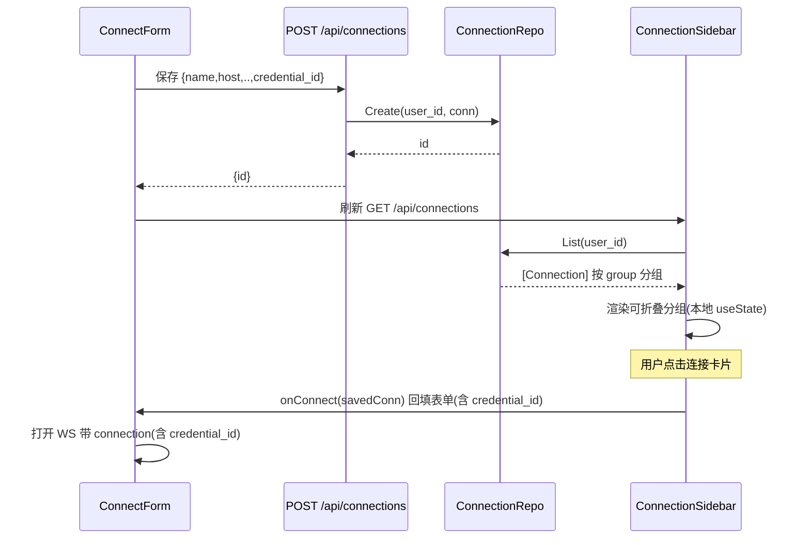
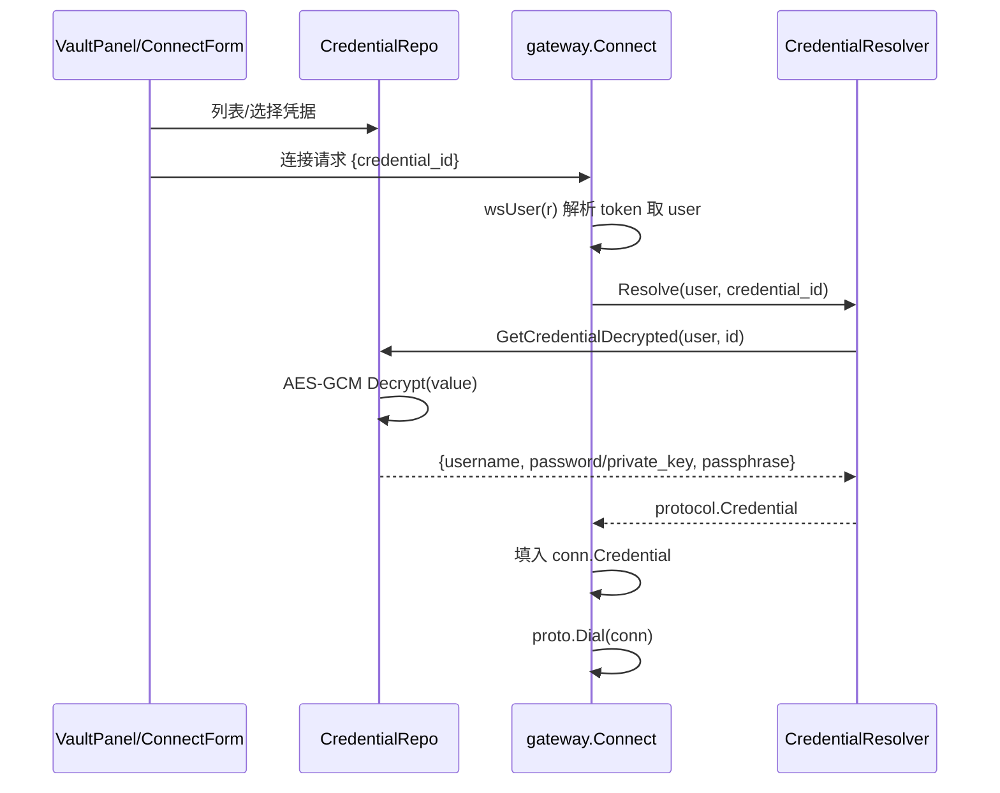
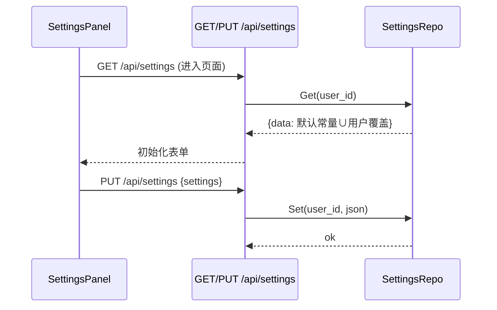
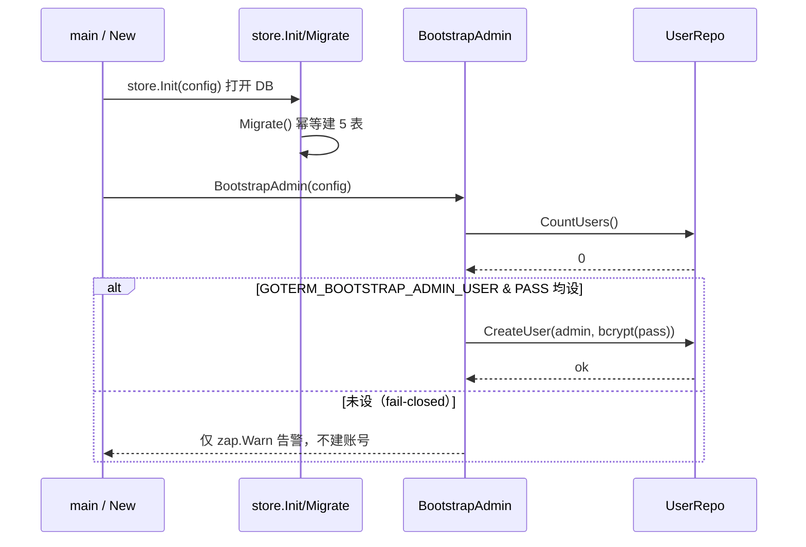
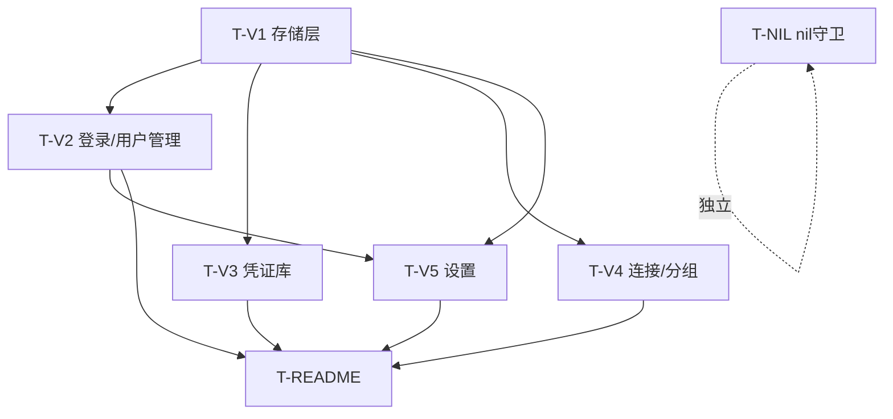

# go-Term 增量架构设计 + 任务分解（Bob / 高见远）

> 本文档为 go-Term 本次 6 项增量的**增量架构设计 + 任务分解**，基于读码核实（见 §0）。
> 设计严格采用主理人已拍板决策 **B1–B7** 与待确认问题决策 **C1–C8**。

## 0. 设计依据与已拍板决策

| 类别 | 决策要点 |
| --- | --- |
| **存储** | SQLite 本地库；纯 Go 驱动 `modernc.org/sqlite`（禁止 CGO 驱动，保 `CGO_ENABLED=0 GOOS=linux` 静态二进制）；DB 路径 `GOTERM_DB_PATH`，默认 `./go-Term.db`。 |
| **登录** | 多用户；Web 登录用户落 `users` 表、密码 bcrypt 哈希；复用现有 JWT 签发（`security.GenerateToken`，**不修改其签名以兼容既有测试**）。 |
| **B1 表** | users / connection_groups / connections / credentials / user_settings，字段严格按 B1。 |
| **B2 登录** | `POST /api/login`→bcrypt 校验→签发 JWT（返 `{token,user,role}`）；`ENABLE_AUTH=1` 时前端登录闸门、所有 `/api/*`（除 `/login`、`/public/config`）与 `/ws` 经 `JWTAuth()`；`GET /api/me` 返 `{user,role}`；users 空且 `GOTERM_BOOTSTRAP_ADMIN_*` 均设时插入首个 admin。 |
| **B3 保存连接** | 密码/私钥不落 `connections`，改存凭证库以 `credential_id` 引用；侧边栏按 group 分组、可折叠（展开/折叠本地状态）；点击回填表单并连接；分组可建/改名/删/排序（单层）。 |
| **B4 凭证库** | `/api/credentials` CRUD 取代旧文件型；password/private_key 用 `security.Encrypt`（密钥 `GOTERM_VAULT_KEY`，缺省回退 `AppSecret`）AES-GCM；users 表密码走 bcrypt，不进 credentials。 |
| **B5 设置** | 每用户设置存 `user_settings(JSON)`；全局默认值来自代码常量，用户值覆盖；扩充项见 B5。 |
| **B6 nil** | `transfer.go` 的 `runTransferRecv`/`runTransferSend` 解引用 `config.Global` 前加 nil 守卫/推迟取值。 |
| **B7 README** | 新增 SQLite、多用户登录与用户管理、连接保存与分组、凭证库、扩充设置及 `GOTERM_DB_PATH`/`GOTERM_VAULT_KEY`/`GOTERM_BOOTSTRAP_ADMIN_*` 配置项；删占位标注；`SERVER_USER` 与 Web 登录正交说明保留。 |
| **C1** | 旧文件型 `/api/credentials` 由 SQLite 实现**取代**（路径仍 `/api/credentials`，删除 `handlers.go` 中文件型 `CredentialsHandler` 逻辑）。 |
| **C2** | 引导 admin **fail-closed**：users 表空且未设 `GOTERM_BOOTSTRAP_ADMIN_*` 时拒绝登录并报错，不自动建默认账号。 |
| **C3** | 加密密钥独立 `GOTERM_VAULT_KEY`，缺省回退 `APP_SECRET`（与 JWT 密钥解耦）。 |
| **C4** | Web 登录只认 `users` 表，与 `SERVER_USER` 白名单完全正交，登录层不叠加 `SERVER_USER` 限制。 |
| **C5** | 每用户设置以**代码常量作默认、用户值覆盖，不新增 config 键**。 |
| **C6** | 分组排序用**上/下按钮**（P1 简单实现）。 |
| **C7** | 新增公开端点 **`GET /api/public/config`** 返 `{auth_enabled, version}`（免 token）。 |
| **C8** | 重写后更新 `api_test.go`/`feature_f3_test.go` 中"白名单+任意密码"旧用例；旧 `credentials.json` 文件型行为删除。 |

---

## 1. 实现方案 + 框架选型

### 1.1 技术栈与选型
- **沿用**：Gin（HTTP/路由）、`golang.org/x/crypto/ssh`（SSH 拨号）、gorilla/websocket（终端 WS）、creack/pty（本地终端）、zap（日志）、viper（配置）。前端 React 19 + Vite 7 + Tailwind v4 + Zustand + xterm.js **均沿用，不引入 MUI**。
- **新增（后端）**：
  - `modernc.org/sqlite`：纯 Go 的 SQLite 驱动（基于 `modernc.org/libc` + 代码生成的 SQLite 引擎），**零 CGO**，可直接 `CGO_ENABLED=0` 静态编译。替代 `mattn/go-sqlite3`。
  - `golang.org/x/crypto/bcrypt`：已随 `golang.org/x/crypto` 在 `go.mod`（v0.26.0）。bcrypt 是 `golang.org/x/crypto` 的子包，**无需新增模块**，但需在 `go.mod` 显式 `require` 顶层 `golang.org/x/crypto` 以让 `go mod tidy` 正确记录（当前已是直接依赖）。
- **复用能力**：
  - `security.Encrypt/Decrypt`（AES-256-GCM，密钥由 `security.DeriveKey(secret)` 派生）→ 凭证库加密落库。
  - `security.GenerateToken/ParseToken` → JWT 签发/校验（**签名保持不变**）。
  - `middleware.JWTAuth()` → 已注入 `c.Set("user", claims.User)`。

### 1.2 SQLite 打开 / 建表时机与策略
- **打开时机**：`config.Load()` 之后，在 `internal.New(cfg)` 内调用 `store.Init(cfg)`。`store.Init` 用 `sql.Open("sqlite", cfg.DBPath)` 打开连接，设置连接池（`SetMaxOpenConns(1)` 推荐以规避 SQLite 写并发，`SetMaxIdleConns(1)`，`SetConnMaxLifetime`），并执行 `Migrate()`。
  - 选择 `MaxOpenConns=1`：SQLite 单写者模型，避免写锁竞争；读多场景下 1 条连接足够（webssh 为低频管理面）。
- **建表策略（首启迁移）**：`Migrate()` 用 `CREATE TABLE IF NOT EXISTS` + `CREATE INDEX IF NOT EXISTS` 幂等建 5 张表（DDL 见 §3.1）。**不使用外部 migration 框架**，保持轻量、自包含。
- **引导 admin（B2/C2）**：`store.BootstrapAdmin(cfg)` 在 `Migrate()` 后调用：
  - `CountUsers()==0` 且 `GOTERM_BOOTSTRAP_ADMIN_USER` 与 `GOTERM_BOOTSTRAP_ADMIN_PASS` **均非空** → 插入 `role=admin`（`bcrypt` 哈希密码）。
  - `CountUsers()==0` 且未同时设置两变量 → **fail-closed**：仅 `zap.L().Warn` 告警，**不**自动建账号；此后任何登录因查无用户返回 `CodeAuthFail`。
- **关闭**：`Server.Shutdown()` 调 `store.Close()` 关闭 `*sql.DB`。
- **版本号**：新增 `internal/version.go` 常量 `Version = "1.0.0"`（或读取 `-ldflags`），供 `/api/public/config` 返回。

### 1.3 凭证解密与 WS 连接（R-VAULT-2）
- `protocol.Connection` 增加字段 `CredentialID string json:"credential_id,omitempty"`。
- 网关包新增包级钩子：`var CredentialResolver func(user, id string) (*protocol.Credential, error)`（默认 nil → 不解析，向后兼容）。
- `internal.New` 中将钩子接驳到 `store.GetCredentialDecrypted(user, id)`。
- `gateway.Connect`：解析 `conn` 后，若 `conn.CredentialID != ""`：
  1. 经 `wsUser(r)` 从 WS 请求 query 的 `token` 解析出 `user`（复用 `security.ParseToken`，与 `checkServerUserWhitelist` 同手法）；
  2. 调 `CredentialResolver(user, conn.CredentialID)` 解密出 `protocol.Credential`；
  3. 赋值 `conn.Credential`，再 `proto.Dial(conn)`。
  - 仅当 `auth_enabled` 且能解析出 user 时解析；否则忽略（`credential_id` 为空或 auth 关闭 → 仍可用内联 `Credential`，行为不变）。

---

## 2. 文件列表（标注 新增 / 修改 / 沿用）

### 2.1 后端

| 文件 | 状态 | 说明 |
| --- | --- | --- |
| `internal/version.go` | **新增** | 版本常量 `Version`。 |
| `internal/store/db.go` | **新增** | 包级 `*sql.DB` 单例；`Init(cfg)`/`Migrate()`/`BootstrapAdmin(cfg)`/`Close()`；连接池。 |
| `internal/store/models.go` | **新增** | Go 结构体 `User`/`ConnectionGroup`/`Connection`/`Credential`/`UserSetting` + 请求/响应 DTO。 |
| `internal/store/users.go` | **新增** | `CreateUser`/`GetUserByUsername`/`ListUsers`/`DeleteUser`/`ResetPassword`/`CountUsers`（bcrypt）。 |
| `internal/store/groups.go` | **新增** | 分组 CRUD + `Reorder(id, sortOrder)`（单层）。 |
| `internal/store/connections.go` | **新增** | 连接 CRUD，按 `user_id` 隔离，`credential_id` 引用。 |
| `internal/store/credentials.go` | **新增** | 凭证 CRUD，AES-GCM 加解密，按 `user_id` 隔离，`GetCredentialDecrypted(user,id)`。 |
| `internal/store/settings.go` | **新增** | `GetSettings(userID)`/`SetSettings(userID, json)`。 |
| `internal/api/auth_handlers.go` | **新增** | `LoginHandler`（重写）/ `MeHandler` / 用户管理 `UsersListHandler`/`UsersCreateHandler`/`UsersDeleteHandler`/`UsersResetPasswordHandler`。 |
| `internal/api/vault_handlers.go` | **新增** | 凭证库 CRUD（取代旧文件型）：`CredentialsList`/`Create`/`Update`/`Delete`/`GetSecret`（按需解密）。 |
| `internal/api/connections_handlers.go` | **新增** | 连接 + 分组 CRUD：`ConnectionsList`/`Create`/`Update`/`Delete`；`GroupsList`/`Create`/`Update`/`Delete`。 |
| `internal/api/settings_handlers.go` | **新增** | `SettingsGet`/`SettingsPut`。 |
| `internal/api/public_handlers.go` | **新增** | `PublicConfigHandler`（`GET /api/public/config`）。 |
| `internal/gateway/credential_resolver.go` | **新增** | 包级 `CredentialResolver` 钩子 + `wsUser(r)` 取 user 辅助。 |
| `internal/config/config.go` | **修改** | 新增 `DBPath`/`VaultKey`/`BootstrapAdminUser`/`BootstrapAdminPass` 字段 + `BindEnv` + 默认值；新增 `VaultKey()` 取值辅助。 |
| `internal/api/router.go` | **修改** | 移除旧 `vaultPath` 行与旧 `/api/credentials` 文件型路由；注册新路由；新增公开 `/api/public/config`；`/api/credentials` 入 JWT 组（去 `RequireServerUser`）。 |
| `internal/api/handlers.go` | **修改** | 删除 `CredentialsHandler`/`loadVault`/`saveVault`/`credentialRecord`/`vaultMu`/`vaultPath`；删除 `LoginHandler`（迁至 auth_handlers）。 |
| `internal/api/middleware.go` | **修改** | 新增 `RoleRequired(role string)` 中间件（查 `users` 表得 role 比对）；保留 `JWTAuth`/`RequireServerUser`。 |
| `internal/protocol/connection.go` | **修改** | `Connection` 增加 `CredentialID string json:"credential_id,omitempty"`。 |
| `internal/gateway/ws.go` | **修改** | `Connect`：解析 `conn` 后按 `CredentialID` 经 `CredentialResolver` 填充 `Credential`。 |
| `internal/gateway/transfer.go` | **修改** | `runTransferRecv` 加 nil 守卫（R-NIL-1）。 |
| `internal/server.go` | **修改** | `New` 内调 `store.Init/Migrate/BootstrapAdmin`；`Shutdown` 调 `store.Close()`。 |
| `go.mod` / `go.sum` | **修改** | 新增 `modernc.org/sqlite`（及传递依赖）；确保 `golang.org/x/crypto` 在 require 块。 |
| `.env.example` | **修改** | 新增 `GOTERM_DB_PATH`/`GOTERM_VAULT_KEY`/`GOTERM_BOOTSTRAP_ADMIN_USER`/`GOTERM_BOOTSTRAP_ADMIN_PASS`。 |
| `README.md` | **修改** | 按 B7/R-README 更新。 |

### 2.2 前端

| 文件 | 状态 | 说明 |
| --- | --- | --- |
| `src/types.ts` | **修改** | 新增 `User`/`ConnectionGroup`/`Connection`/`Credential`/`UserSettings` 类型；`ConnectionSpec` 增加 `credential_id?`。 |
| `src/api/rest.ts` | **修改** | `login` 成功后写 `localStorage`；新增 `publicConfig`/`me`/`users`/`credentials`/`connections`/`connectionGroups`/`settings` 端点。 |
| `src/store/authStore.ts` | **新增** | `{token,user,role}` + `login()`/`logout()`（zustand persist）。 |
| `src/store/settingStore.ts` | **修改** | 迁移为后端读写 + 本地兜底；新增默认常量（C5）。 |
| `src/components/Login.tsx` | **新增** | 登录页（用户名+密码+错误态）。 |
| `src/App.tsx` | **修改** | 登录闸门逻辑（`auth_enabled` 判断 + 无 token 显登录页 + 登出）。 |
| `src/ssh/connectForm.tsx` | **修改** | 增加"保存"按钮 + "从凭证库选择"下拉。 |
| `src/components/ConnectionSidebar.tsx` | **新增** | 连接管理侧边栏（分组折叠/新建/重命名/删除/上移下移动/点击回填）。 |
| `src/components/VaultPanel.tsx` | **新增** | 凭证库 UI（列表/增删改/按需解密复制）。 |
| `src/components/SettingsPanel.tsx` | **新增** | 扩充设置页（含用户管理区，仅 admin 可见）。 |

### 2.3 沿用（不修改，仅引用）
- `internal/security/crypto.go`（`Encrypt`/`Decrypt`/`DeriveKey`）、`internal/security/jwt.go`（`GenerateToken`/`ParseToken`）、`internal/api/middleware.go` 的 `JWTAuth`/`RequireServerUser`、`frontend/src/api/ws.ts`（token 已在 query 携带）、`frontend/src/store/sessionStore.ts`。

---

## 3. 数据结构 / 接口（精简 schema）

### 3.1 五张表 DDL（含 user_id 索引）

```sql
-- 用户（bcrypt 哈希，不存明文；与 SERVER_USER 正交）
CREATE TABLE IF NOT EXISTS users (
  id            INTEGER PRIMARY KEY AUTOINCREMENT,
  username      TEXT NOT NULL UNIQUE,
  password_hash TEXT NOT NULL,
  role          TEXT NOT NULL DEFAULT 'user',   -- 'admin' | 'user'
  created_at    DATETIME NOT NULL DEFAULT CURRENT_TIMESTAMP
);
CREATE INDEX IF NOT EXISTS idx_users_username ON users(username);

-- 连接分组（单层：parent_id 可空；sort_order 排序）
CREATE TABLE IF NOT EXISTS connection_groups (
  id         INTEGER PRIMARY KEY AUTOINCREMENT,
  user_id    INTEGER NOT NULL,
  name       TEXT NOT NULL,
  parent_id  INTEGER,
  sort_order INTEGER NOT NULL DEFAULT 0,
  FOREIGN KEY(user_id)   REFERENCES users(id)            ON DELETE CASCADE,
  FOREIGN KEY(parent_id) REFERENCES connection_groups(id) ON DELETE SET NULL
);
CREATE INDEX IF NOT EXISTS idx_groups_user ON connection_groups(user_id);

-- 连接（密码/私钥不落本表，改存凭证库以 credential_id 引用）
CREATE TABLE IF NOT EXISTS connections (
  id             INTEGER PRIMARY KEY AUTOINCREMENT,
  user_id        INTEGER NOT NULL,
  group_id       INTEGER,
  name           TEXT NOT NULL,
  protocol       TEXT NOT NULL,
  host           TEXT,
  port           INTEGER,
  username       TEXT,
  auth_type      TEXT,
  credential_id  INTEGER,
  ssh_config_host TEXT,
  proxy          TEXT,        -- JSON
  hops           TEXT,        -- JSON
  options        TEXT,        -- JSON
  created_at     DATETIME NOT NULL DEFAULT CURRENT_TIMESTAMP,
  updated_at     DATETIME NOT NULL DEFAULT CURRENT_TIMESTAMP,
  FOREIGN KEY(user_id)       REFERENCES users(id)          ON DELETE CASCADE,
  FOREIGN KEY(group_id)      REFERENCES connection_groups(id) ON DELETE SET NULL,
  FOREIGN KEY(credential_id) REFERENCES credentials(id)    ON DELETE SET NULL
);
CREATE INDEX IF NOT EXISTS idx_conn_user  ON connections(user_id);
CREATE INDEX IF NOT EXISTS idx_conn_group ON connections(group_id);

-- 凭证库（value 为 AES-GCM 密文 blob）
CREATE TABLE IF NOT EXISTS credentials (
  id         INTEGER PRIMARY KEY AUTOINCREMENT,
  user_id    INTEGER NOT NULL,
  name       TEXT NOT NULL,
  type       TEXT NOT NULL,   -- 'password' | 'private_key'
  value      TEXT NOT NULL,   -- 加密后的 {password|private_key, passphrase}
  meta       TEXT,            -- JSON（如 username、备注）
  created_at DATETIME NOT NULL DEFAULT CURRENT_TIMESTAMP,
  FOREIGN KEY(user_id) REFERENCES users(id) ON DELETE CASCADE
);
CREATE INDEX IF NOT EXISTS idx_cred_user ON credentials(user_id);

-- 每用户设置（data 为 JSON，默认来自代码常量，用户值覆盖）
CREATE TABLE IF NOT EXISTS user_settings (
  user_id INTEGER PRIMARY KEY,
  data    TEXT NOT NULL,
  FOREIGN KEY(user_id) REFERENCES users(id) ON DELETE CASCADE
);
```

### 3.2 REST 端点清单（method + path + auth + 说明）

| Method | Path | Auth | 请求 | 响应 | 说明 |
| --- | --- | --- | --- | --- | --- |
| POST | `/api/login` | 公开 | `{user,password}` | `{token,user,role}` | 重写：查 `users`+bcrypt（C4 正交 SERVER_USER）。 |
| GET | `/api/public/config` | 公开 | — | `{auth_enabled,version}` | C7。 |
| GET | `/api/me` | JWT | — | `{user,role}` | B2。 |
| GET | `/api/users` | JWT+admin | — | `[{id,username,role,created_at}]` | R-AUTH-6。 |
| POST | `/api/users` | JWT+admin | `{username,password,role}` | `{id}` | 建用户（bcrypt）。 |
| DELETE | `/api/users/:id` | JWT+admin | — | — | 删用户。 |
| POST | `/api/users/:id/reset-password` | JWT+admin | `{password}` | — | 改密（bcrypt）。 |
| GET | `/api/credentials` | JWT | — | `[{id,name,type,meta,created_at}]` | 列表**不返明文**（B4）。 |
| POST | `/api/credentials` | JWT | `{name,type,username,password\|private_key,passphrase,meta}` | `{id}` | 值 AES-GCM 落库。 |
| PUT | `/api/credentials/:id` | JWT | 同上（部分） | — | 更新（重加密）。 |
| DELETE | `/api/credentials/:id` | JWT | — | — | 删除。 |
| GET | `/api/credentials/:id/secret` | JWT | — | `{username,password\|private_key,passphrase}` | 按需解密返回明文。 |
| GET | `/api/connections` | JWT | — | `[Connection]` | 按 user 隔离。 |
| POST | `/api/connections` | JWT | 见 B1 字段 | `{id}` | 保存连接（`credential_id` 引用）。 |
| PUT | `/api/connections/:id` | JWT | 部分字段 | — | 更新。 |
| DELETE | `/api/connections/:id` | JWT | — | — | 删除。 |
| GET | `/api/connection-groups` | JWT | — | `[Group]` | 单层分组。 |
| POST | `/api/connection-groups` | JWT | `{name,parent_id,sort_order}` | `{id}` | 建组。 |
| PUT | `/api/connection-groups/:id` | JWT | `{name,sort_order}` | — | 改名/排序（C6 上/下按钮）。 |
| DELETE | `/api/connection-groups/:id` | JWT | — | — | 删组（`group_id` 置 NULL）。 |
| GET | `/api/settings` | JWT | — | `UserSettings(JSON)` | R-SET-1。 |
| PUT | `/api/settings` | JWT | `UserSettings(JSON)` | — | 覆盖保存。 |

> 既有端点（`/test-terminal`、`/download`、`/upload`、`/hostkey`、`/ssh-config-hosts`、`/sessions`、`/transfer-*`、`/list`、`/file`、`/mkdir`、`/rename`、`/remove`、`/local-shell-enabled`）**全部沿用**，仅新增/改造上述端点。

### 3.3 WS 协议（不变）
- 握手：`GET /ws`（`ENABLE_AUTH=1` 时经 `JWTAuth`，token 经 query `?token=`）。
- 首帧 `connect` 消息体 `payload.connection` 仍为 `protocol.Connection`；**新增可选** `credential_id` 字段（取代内联 `credential` 用于已存连接）。网关按 §1.3 解析填充 `Credential` 后拨号。其余消息类型（`input`/`output`/`resize`/`transfer`/`transfer_status`/`error`）不变。

### 3.4 前端关键类型（新增/扩展 `types.ts`）
```ts
export interface User { id: number; username: string; role: 'admin' | 'user'; created_at: string }
export interface ConnectionGroup { id: number; user_id: number; name: string; parent_id: number | null; sort_order: number }
export interface SavedConnection {
  id: number; user_id: number; group_id: number | null; name: string;
  protocol: ProtocolType; host: string; port: number; username: string;
  auth_type: string; credential_id: number | null; ssh_config_host?: string;
  proxy?: any; hops?: any; options?: any; created_at: string; updated_at: string;
}
export interface CredentialMeta { id: number; name: string; type: 'password' | 'private_key'; meta: any; created_at: string }
export interface CredentialSecret { username: string; password?: string; private_key?: string; passphrase?: string }
export interface UserSettings {
  // 终端外观
  theme: 'dark' | 'light'; fontSize: number; fontFamily: string;
  cursorStyle: 'block' | 'bar' | 'underline'; scrollback: number;
  // 默认连接
  defaultProtocol: ProtocolType; defaultAuthType: string;
  // 传输默认
  defaultTransfer: 'sftp' | 'ftp'; recvAutoDownload: boolean;
  // 安全
  strictHostKeyChecking: boolean; connectTimeoutSec: number;
  // 进阶（R-SET-3 可选）
  webgl?: boolean; lineHeight?: number; letterSpacing?: number;
}
// ConnectionSpec 增加：
export interface ConnectionSpec { /* 既有字段… */ credential_id?: number }
```

---

## 4. 程序调用流程（mermaid 时序图）

> 5 张时序图另见 `docs/sequence-diagram.mermaid`；类图见 `docs/class-diagram.mermaid`。

### ① 用户名密码登录 → JWT → 闸门
```mermaid
sequenceDiagram
  participant U as 浏览器(Login)
  participant A as App/闸门
  participant PC as GET /api/public/config
  participant LH as POST /api/login
  participant UR as UserRepo
  participant JWT as security
  U->>PC: 启动请求公开配置
  PC-->>U: {auth_enabled, version}
  U->>A: auth_enabled && 无 token → 渲染登录页
  U->>LH: 提交 {user, password}
  LH->>UR: GetUserByUsername(user)
  UR-->>LH: User(password_hash, role) 或 空
  LH->>LH: bcrypt.Compare(password, hash)
  LH->>JWT: GenerateToken(user, secret, exp)
  JWT-->>LH: token
  LH-->>U: {token, user, role}
  U->>A: localStorage.token=token; 进入主界面
```

### ② 保存连接 → 侧边栏 → 点击回填连接


### ③ 凭证库选凭据 → connect 时解密填入 Credential


### ④ 用户设置读写


### ⑤ 引导 admin（首启环境变量）


---

## 5. 任务列表（有序、含依赖、按实现顺序）

> 编号遵循主理人约定：存储层 T-V1 最先；登录 T-V2、凭证库 T-V3、连接 T-V4、设置 T-V5 均依赖 T-V1；前端各块随对应后端端点；nil 守卫 T-NIL 独立；README 最后。
> 覆盖需求：R-AUTH-1~6、R-VAULT-1/2、R-CONN-1/2、R-SET-1/2、R-NIL-1、R-README。

### T-V1 存储层基础设施（P0）
- **目标**：落地 SQLite 封装 + 5 表迁移 + 配置字段 + 引导 admin。
- **涉及文件**：`internal/store/db.go`、`internal/store/models.go`、`internal/store/users.go`、`internal/config/config.go`、`internal/server.go`、`go.mod`、`internal/version.go`、`.env.example`。
- **依赖**：无（最先）。
- **验收点**：`CGO_ENABLED=0 GOOS=linux go build` 通过；首启生成 `go-Term.db` 且 5 表结构与 B1 一致；`GOTERM_DB_PATH` 生效、默认 `./go-Term.db`；`GOTERM_BOOTSTRAP_ADMIN_*` 均设时插入首个 admin，重复启动不重复插入（R-AUTH-1/3）。

### T-V2 多用户登录与用户管理（P0）
- **目标**：重写登录（bcrypt+JWT+R-B2/R-C4）、`/api/me`、用户管理（admin）、公开配置端点、前端登录闸门/页。
- **涉及文件**：`internal/api/auth_handlers.go`、`internal/api/public_handlers.go`、`internal/api/middleware.go`、`internal/api/router.go`、`internal/api/handlers.go`（删旧 Login/Credentials）、`frontend/src/components/Login.tsx`、`frontend/src/App.tsx`、`frontend/src/store/authStore.ts`、`frontend/src/api/rest.ts`、`internal/api/api_test.go`、`internal/api/feature_f3_test.go`（按 C8 重写旧用例）。
- **依赖**：T-V1。
- **验收点**：错误密码被拒、正确密码拿 token（返 `{token,user,role}`）；`/api/me` 返身份；`ENABLE_AUTH=1` 未登录见登录页、登录后入主界面、刷新凭 token 保持；admin 可增删用户/改密，非 admin 调用户管理返 1002；旧"白名单+任意密码"用例已改写（R-AUTH-2/3/4/5/6，C8）。

### T-V3 凭证库（P0）
- **目标**：SQLite 每用户凭证 CRUD（取代旧文件型），AES-GCM 加密，连接引用与 WS 解密。
- **涉及文件**：`internal/api/vault_handlers.go`、`internal/store/credentials.go`、`internal/gateway/credential_resolver.go`、`internal/gateway/ws.go`、`internal/protocol/connection.go`、`frontend/src/components/VaultPanel.tsx`、`frontend/src/ssh/connectForm.tsx`（从凭证库选择）、`frontend/src/types.ts`、`frontend/src/api/rest.ts`。
- **依赖**：T-V1（软依赖 T-V4 仅 UI 引用，可并行）。
- **验收点**：password/私钥明文不落库（AES-GCM）；列表不返明文，按需 `/secret` 解密；按 `user_id` 隔离，越权返 1002；已存连接经 WS `credential_id` 正确解密复用；旧 `credentials.json` 文件型行为删除（R-VAULT-1/2，C1）。

### T-V4 连接保存与分组（P0）
- **目标**：连接 + 单层分组持久化与前端侧边栏（折叠/排序/回填）。
- **涉及文件**：`internal/api/connections_handlers.go`、`internal/store/connections.go`、`internal/store/groups.go`、`frontend/src/components/ConnectionSidebar.tsx`、`frontend/src/App.tsx`（Sidebar 'connect' 面板）、`frontend/src/ssh/connectForm.tsx`（保存按钮）、`frontend/src/types.ts`。
- **依赖**：T-V1。
- **验收点**：保存后可查到；分组可建/改名/删/上移下移动（C6）；未分组归入虚拟"未分组"；侧边栏分组可展开/折叠（本地状态）；点击连接回填并连接（R-CONN-1/2）。

### T-V5 每用户设置扩充（P1）
- **目标**：每用户设置后端读写 + 设置页大幅扩充 + 用户管理区（admin）。
- **涉及文件**：`internal/api/settings_handlers.go`、`internal/store/settings.go`、`frontend/src/store/settingStore.ts`（后端读写+本地兜底+默认常量 C5）、`frontend/src/components/SettingsPanel.tsx`、`frontend/src/App.tsx`（settings 面板）、`frontend/src/types.ts`。
- **依赖**：T-V1（依赖 T-V2 的 `authStore.role` 判断 admin 区）。
- **验收点**：设置可保存并跨会话/刷新恢复；不同用户互不影响；扩充项（字体/字号/主题/光标/滚动行数、默认协议/认证、传输默认/recv 自动下载、known_hosts 策略/连接超时）均可配置持久化；新建连接默认取自用户设置（R-SET-1/2）。

### T-NIL transfer.go nil 守卫（P1）
- **目标**：`runTransferRecv` 解引用 `config.Global` 前加 nil 守卫。
- **涉及文件**：`internal/gateway/transfer.go`、`internal/gateway/transfer_test.go`（补 nil 场景单测）。
- **依赖**：无（独立，建议与后端并行）。
- **验收点**：`config.Global==nil` 时 recv 返回 error 而非 panic；send 路径不变（R-NIL-1）。

### T-README README 更新（P0）
- **目标**：删除占位标注，新增 SQLite/多用户/凭证库/分组/扩充设置及新增配置项说明。
- **涉及文件**：`README.md`（L18 占位、§6 配置表、§10 安全说明、新增用户管理与 vault 章节）。
- **依赖**：T-V1~T-V5（最后，基于最终实现）。
- **验收点**：README 无"占位/PLACEHOLDER"标注；功能描述与实现一致；含 `GOTERM_DB_PATH`/`GOTERM_VAULT_KEY`/`GOTERM_BOOTSTRAP_ADMIN_*`；保留 `SERVER_USER` 与 Web 登录正交说明；移除文件型 `credentials.json` 保险库与"仅白名单登录"旧描述（R-README，B7）。

### 任务依赖图


---

## 6. 依赖包列表
```
- modernc.org/sqlite  (新增，纯 Go SQLite 驱动；零 CGO)
- golang.org/x/crypto (已依赖 v0.26.0；新增显式使用子包 golang.org/x/crypto/bcrypt)
# 以下均沿用，不新增：
- github.com/gin-gonic/gin
- github.com/golang-jwt/jwt/v5
- github.com/gorilla/websocket
- github.com/creack/pty
- github.com/pkg/sftp / jlaffaye/ftp (传输)
- go.uber.org/zap / spf13/viper (日志/配置)
- 前端：react@19 / react-dom@19 / zustand@5 / vite@7 / tailwindcss@4 / xterm (沿用)
```
> ⚠️ 生产构建保持 `CGO_ENABLED=0 GOOS=linux`（Makefile/Dockerfile 已具备）；`modernc.org/sqlite` 不引入 CGO，故静态二进制不受影响。

---

## 7. 共享知识（跨文件约定）

1. **`config.Global` 非 nil 保证时机**：`main()` 最先调 `config.Load()` 并赋值 `Global`；随后 `internal.New` → `store.Init`（打开 DB）。所有 handler 已依赖 `Global` 非 nil。单元测试中现有写法为直接 `config.Global = &config.Config{...}`；**登录相关新单测需在测试内先 `store.Init` 指向临时 DB 并注入用户**（因 `LoginHandler` 现依赖 `UserRepo`），旧仅 set `config.Global` 的用例须改写（C8）。
2. **AES-GCM 复用与 vault key 取法**：统一调用 `security.Encrypt/Decrypt(plaintext, key)`；新增 `config.VaultKey` 字段，`config` 提供 `func VaultKey() string { if v!="" {return v}; return AppSecret }`（C3 缺省回退 `APP_SECRET`）。凭证仓储加解密一律 `config.VaultKey()`，与 JWT 密钥解耦。
3. **JWT user 注入与角色校验**：`JWTAuth()` 已 `c.Set("user", claims.User)`；新增 `RoleRequired(role)` 在中间件内取 `user` → 查 `users` 表得 `role` → 比对，失败 `CodePermissionDenied(1002)`。**不改 `GenerateToken` 签名**（现有 `api_test.go` 仍用 3 参调用）；role 以 DB 为权威（避免 token 内 role 失配）。
4. **连接/凭证按 `user_id` 隔离**：所有 repo 查询必须带 `user_id`（取自 JWT `c.Get("user")`）；越权返 `CodePermissionDenied`；连接引用的 `credential_id` 也必须属同一 `user`（`GetCredentialDecrypted(user, id)` 以 user 限定）。
5. **前端 token 与闸门逻辑**：`rest.login` 成功后 `localStorage.setItem('webssh_token', token)`；`App` 启动先 `GET /api/public/config`，若 `auth_enabled && 无 token` → 渲染 `Login`；否则主界面；登出清 token 回登录页；`fetch` 经 `authHeader()` 自动带 `Bearer`。`WS` 已在 query 带 token（既有 `ws.ts`）。
6. **transfer nil 守卫写法**：`runTransferRecv` 顶部 `if config.Global == nil { return "", fmt.Errorf("config not loaded") }`；或把 `dir := config.Global.DownloadDir` 推迟到 `os.MkdirAll(dir,...)` 之前并做 nil 判断（B6）。`runTransferSend` 不引用 `config.Global`，保持不变。
7. **分组排序**：单层、上/下按钮（C6）；`sort_order` 为相对整数，`Reorder` 调整相邻两项顺序，前端发 `PUT /api/connection-groups/:id {sort_order}`。
8. **公开端点免 token**：`GET /api/public/config` 注册在 `r`（非 `apiG` JWT 组），绕过 `JWTAuth`；`/api/login` 同理公开。

---

## 8. 待明确事项
**无。** C1–C8 与 B1–B7 已完整覆盖所有待确认点；表结构、端点、密钥策略、登录正交性、默认来源、排序方式、公开端点、测试回归均已拍板。
